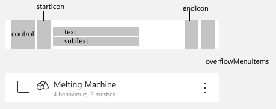

# Common list control

Author: Mitch Snyder
Date: 2/17/2022

## Problem statement

We have a lot of lists in our app and all of them have their own implementations today and that means we end up having a lot of duplicate code and inconsistent user experiences

### User problem

Users get different experiences when they see different lists. They have visual differences as well as interaction differences. Clicking the item sometimes checks an item, sometimes navigates, sometimes opens the overflow menu.
In addition, most of the lists are not accessible via keyboard today and most are missing the proper tags for screen readers.

### Technical problem

We need a common control to handle the rendering of list items as well as taking care of the accessibility items that we can drop in anywhere in the app to get a standardized list of items the user can interact with or view.

When auditing existing controls in the [designs](https://www.figma.com/file/LsmZeVOZJgwZs75HPTQmgU/3D-Scenes-Mock-Screens?node-id=41988%3A80285) I found the following examples.


___

## Proposed Solution

### What changes

Lots of places have their own list controls. This will impact the following areas of the app:

- Elements list
  - Meshes tab
  - Behaviors tab
  - Aliased twins tab
- Behaviors list
  - Elements tab
  - Alerts tab
  - Widgets tab

### What is new

Will make a new control called `cardboard-list`. This will help to consolidate the details of implementing a list of items to ensure all lists are accessible and easy to drop in whereever we need them.

Will make a new control called `cardboard-list-item`. Most of the props will be optional as there are a lot of permutations of our list items today so we want the flexibility to keep those in the meantime.



Proposed props for the new components

```ts
interface CardboardListProps {
  ariaLabel: string; // screen reader name of the list
  items: CardboardListItemProps[]; // list items
  onClick: () => void; // triggered when list item is clicked
  textToHighlight?: string; // text being searched for, will highlight on the items in the list
}
```

```ts
interface CardboardListItemProps {
  iconEndName?: string; // icon to render on the right side of the list item
  iconStartName?: string; // icon to render at the left side of the list item
  isChecked?: boolean; // if provided will result in rendering the checkbox in either checked or unchecked state. If not provided, will not render a checkbox
  key: string; // unique name for the list to generate item keys
  overflowMenuItems?: IContextualMenuItem[]; // items to put in the overflow menu. If empty, menu will not show
  textPrimary: string; // primary text to show
  textSecondary?: string; // secondary text to show below the main text
}
```

```ts
interface CardboardListItemInternalProps extends CardboardListItemProps {
  ariaLabel: string; // screen reader text to use for the list item
  index: number; // index of the list item in the list. Used for unique keys
}
```

___

## Validations & test cases

_how will we know that it's working as designed? What are the edge cases?_

### Functionality

- [ ] when `isChecked` prop is provided, the checkbox shows up in the checked/unchecked state based on the value provided
- [ ] when `startIconName` is provided, icon shows up
- [ ] when `endIconName` is provided, icon shows up
- [ ] when `overflowMenuItems` is provided, the menu shows up and can be activated by clicking or pressing space
- [ ] overflow menu icon only shows on focus or hover of the element
- [ ] onClick action is triggered when clicked

### Theming

- [ ] Light mode is usable
- [ ] Dark mode is usable

### Accessibility

- [ ] pressing `Space` on a list item opens the list and sets context in the menu, `escape` closes the menu and returns focus to the list item that was selected
- [ ] pressing `Enter` on a list item activates the onClick for the list item
- [ ] clicking anywhere on the list item (except overflow) activates the onClick for the list item
- [ ] tabbing onto the list selects the first element
- [ ] tabbing once after putting focus on the list will navigate to the next control after the list. (won't tab through the list)

___

## Impact considerations

_what other parts of the app will get impacted?_
We are going to be touching a whole lot of lists in the app. We can do that migration over time to help limit impact all at one shot.
___

## Accessibility considerations

_have we thought through the accessibility of this view/control?_

- Screen readers
  - need to make sure that iterating the list gives good screen reader info (ex: `<primary text>, <secondary text (if present)>, <is checked/not checked (if checkable)> item <#> of <#> <selected>`)
  - QUESTION: where do we tell the user they can use "space" to open the overflow?
- Keyboard access
  - "Tab" onto the list, tabbing again gets you past the list
  - "Arrow keys" to navigate the list
  - "Enter" should select the list item
  - "Space" should open the list item overflow

___

## Security considerations

- New APIs?
  - no new APIs or data getting stored
- New libraries/packages?
  - no new libraries

___

## Task breakdown

_What are the chunks we plan to tackle in this? Roughly how long will those take (hours, days, weeks)?_

- create the list & list items - 3-4 days
- migrate existing lists to use the new control - 3-4 days