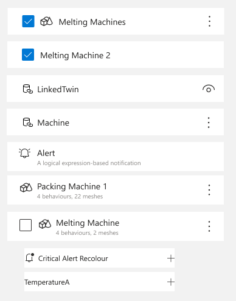
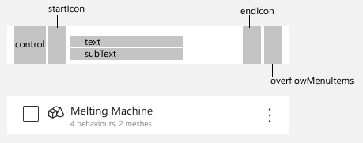

# Spec name

## Problem statement

### User problem

### Technical problem

When auditing existing controls in the [designs](https://www.figma.com/file/LsmZeVOZJgwZs75HPTQmgU/3D-Scenes-Mock-Screens?node-id=41988%3A80285) I found the following examples.


___

## Proposed Solution

### What changes

Lots of places have their own list controls. This will impact the following areas of the app

- dd

### What is new

Will make a new control called `cardboard-list`. This will help to consolidate the details of implementing a list of items to ensure all lists are accessible and easy to drop in whereever we need them.

Will make a new control called `cardboard-list-item`. Most of the props will be optional as there are a lot of permutations of our list items today so we want the flexibility to keep those in the meantime.



Proposed props for the new components

```ts
interface CardboardListProps {
  ariaLabel: string; // screen reader text to use for the list item
  searchText?: string; // text being searched for, will highlight on the items in the list
}
```

```ts
interface CardboardListItemProps {
  ariaLabel: string; // screen reader text to use for the list item
  iconEnd?: IIconProps; // icon to render on the right side of the list item
  iconStart?: IIconProps; // icon to render at the left side of the list item
  isSelected?: boolean; // if provided will result in rendering the checkbox in either checked or unchecked state. If not provided, will not render a checkbox
  onClick: () => void; // triggered when list item is clicked
  overflowMenuItems?: IContextualMenuProps;
  textPrimary: string; // primary text to show
  textSecondary?: string; // secondary text to show below the main text
  textToHighlight?: string; // text to highlight on the primary text
}
```

___

## Validations & test cases

_how will we know that it's working as designed? What are the edge cases?_
Test cases

- [ ] Test case 1

___

## Impact considerations

_what other parts of the app will get impacted?_

___

## Accessibility considerations

_have we thought through the accessibility of this view/control?_

- Screen readers
- Keyboard access

___

## Security considerations

- New APIs?
- New libraries/packages?

___

## Task breakdown

_- What are the chunks we plan to tackle in this?_
_- Roughly how long will those take (hours, days, weeks)?_
